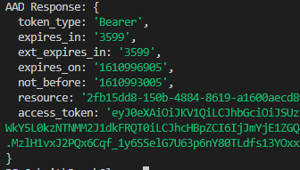
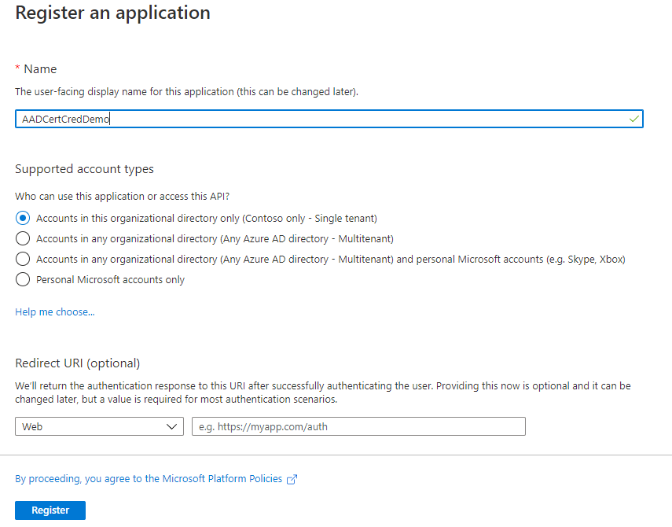
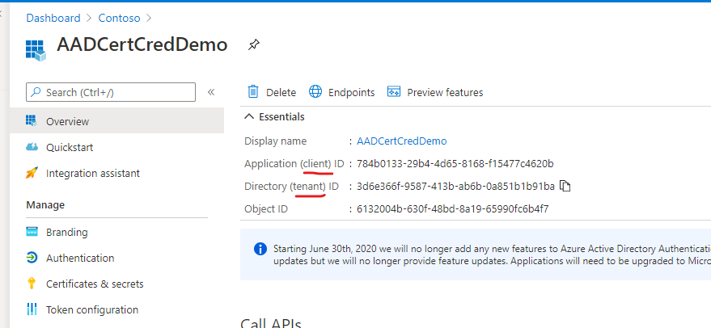
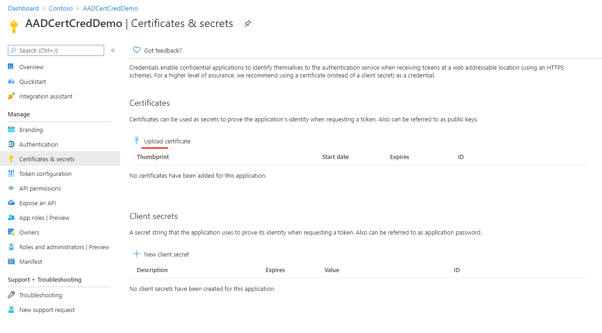

# Azure AD Client Credentials with Certificate - Code Examples for Node.js
This is sample repository of code and helper function which I created for requesting Azure AD Tokens with the use of certificate credentials in Oauth2 Client Credentials Flow. 

Previously I've been using the ADAL JS, but as it's being phased out I decided try my own implementation to understand the flow more comprehensively.

- If you are looking for production use cases please check [@azure/msal-node](https://azuread.github.io/microsoft-authentication-library-for-js/ref/msal-node/) for NodeJS 
  - It has example for Client Credentials flow with secret, looking at other examples, it seems that you can also provide certificate to the Application Constructor but I have not tested it at the moment of writing.


**Contents**
- [Azure AD Client Credentials with Certificate - Code Examples for Node.js](#azure-ad-client-credentials-with-certificate---code-examples-for-nodejs)
  - [Depedencies and references](#depedencies-and-references)
    - [Reference documentation](#reference-documentation)
  - [Flow](#flow)
  - [How-to](#how-to)
    - [1. Create new Azure AD application](#1-create-new-azure-ad-application)
    - [2. Generate RSA Key Pair and X5T with createConfig.js](#2-generate-rsa-key-pair-and-x5t-with-createconfigjs)
      - [Alternative setup path](#alternative-setup-path)
      - [Easy setup path](#easy-setup-path)
      - [2.1 Setup createConfig.js](#21-setup-createconfigjs)
      - [2.2 Run createConfig.js](#22-run-createconfigjs)
    - [3. Upload the public key for the App Registration](#3-upload-the-public-key-for-the-app-registration)
    - [4. Run ClientCredentialsWithCert.js](#4-run-clientcredentialswithcertjs)
    - [5. End](#5-end)

## Depedencies and references
|Depedencies| NPM Description | Use in project|
|---|---|---|
| [jsonwebtoken](https://www.npmjs.com/package/jsonwebtoken)   |*An implementation of JSON Web Tokens*   | Creation and sign-in of tokens  |
| [uuid]() |*For the creation of RFC4122 UUIDs*| JTI claim in token|
[axios](https://www.npmjs.com/package/axios) | *Promise based HTTP client for the browser and node.js*| Used to call Azure AD Token Endpoint

* Helpful example at [redthunder.blog](https://redthunder.blog/2017/06/08/jwts-jwks-kids-x5ts-oh-my) for Node.JS was used
   to generate X5T header in JWT tokens. The author is credited in the actual code, and in this readme 
  ```javascript
   // code below from https://redthunder.blog/2017/06/08/jwts-jwks-kids-x5ts-oh-my/
    var sigOctets = shaSig.split(":");
    var sigBuffer = Buffer.alloc(sigOctets.length)
    for(var i=0; i<sigOctets.length; i++){
       sigBuffer.writeUInt8(parseInt(sigOctets[i], 16), i);
    }
    //Perform base64url-encoding as per RFC7515 Appendix C
    // code 
   ```
* [OpenSSL](https://www.openssl.org/) is used in helper function for generating RSA key pair and X5T
* Example for ca.conf was used from [Github Gist](https://gist.github.com/klingerf/d43738ac98b6bf0479c47987977a7782) by [https://github.com/klingerf](https://github.com/klingerf) 
  * This is needed for the creation of X509 rsa key pair, if you have production use case review carefully all params in the CA.CNF file and modify appropriately. 
### Reference documentation
The documentation for Microsoft Identity Platform authentication via certificate credentials has been main source for information for creating this example 
- [Microsoft identity platform application authentication certificate credentials](https://docs.microsoft.com/en-us/azure/active-directory/develop/active-directory-certificate-credentials)
 

## Flow
**The flow is sheer genius IMO:** Embed JWT token in your request for the Azure AD request, get Access Token in response, Voila!
1. **Create Token**:     Create and sign JWT token with following claims using the JSONWEBTOKEN library
   ```javascript
   // Example, peek code for actual implementation
   var claims = {
            "aud": `https://sts.windows.net/${tenantinfo}/`,
            "iss": appid,
            "sub": appid,
            "jti":"guid"
            "exp":"date"
        }
    // Code includes infor about the headers used
   ```
2. **Request**: Send the token to Azure AD. Azure AD will check the signature with the public key that is stored in Azure AD for your application registration
```javascript
//Example of request payload
{
grant_type: "client_credentials",
client_assertion_type: "urn:ietf:params:oauth:client-assertion-type:jwt-bearer",
client_id: appid,
client_assertion: "embeddedJWTTokenHere",
resource: "TheAPIbeingCalled"
}
```
3. **Response**:    If the Signature checks Azure AD will provide the client with new access token in the response. 
   - this token is signed with private key of Azure AD, and meant to be verified by the Public key from tenant metadata (.well-known) by the API verifying this token
   

    

4. Use the token to consume Azure AD protected API's

## How-to

### 1. Create new Azure AD application 
Go to [Azure AD Portal App Registrations](https://aad.portal.azure.com/#blade/Microsoft_AAD_IAM/ActiveDirectoryMenuBlade/RegisteredApps) 
- Click 'New Registration' and 'Register' once done


- Take not of the values for clientId and TenantId


### 2. Generate RSA Key Pair and X5T with createConfig.js
#### Alternative setup path
*(if you generate the key pair and X5T value in some other method, just populate the nodeConfig.json and key paths to ClientCredentials.js)*
```javascript
//ClientCredentialsWithCert.js
var pub = require('fs').readFileSync('./public1.pem').toString()
var priv = require('fs').readFileSync('./private1.pem').toString()
```
#### Easy setup path
<span style="color:red">**Currently working only on openssl version that can take cnf file via cli params **</span>.


  - For this you need to have OPENSSL installed, and available directly as openssl from command line without any path specified 
 
  - you can use  ``choco install openssl`` for windows to setup openssl for it to be available directly from cmd as openssl.exe / openssl 
    - In Linux openssl is often pre-installed.

 #### 2.1 Setup createConfig.js
  - Populate values for appId and tenantId with values gotten from step [Create new Azure AD application ](#1-create-new-azure-ad-application)
```javascript
// from createConfig.js
var appid = '784b0133-29b4-4d65-8168-f15477c4620b'
var tenantId = '3d6e366f-9587-413b-ab6b-0a851b1b91ba'
```
 #### 2.2 Run createConfig.js 
start by installing depedencies with
`` NPM install `` 
Then create configuration
`` node .\createConfig.js `` 

`` // expected result: config file created at \nodeconfig.json `` 


### 3. Upload the public key for the App Registration
**(you can also use existing application)*
- Go to 'Certificates and Secrets' use the 'upload certificate' to upload the public1.pem key

- If the upload was sucessful you will see the public key in the portal under 'Certificates'


### 4. Run ClientCredentialsWithCert.js
Expected response includes the token:

``AAD Response: {
  token_type: 'Bearer',
  expires_in: '3599',
  ext_expires_in: '3599',
  expires_on: '1611044393',
  not_before: '1611040493',
  resource: '784b0133-29b4-4d65-8168-f15477c4620b',
  access_token: 'g'
} ``   

### 5. End
Congratz. You've completed the workflow!


